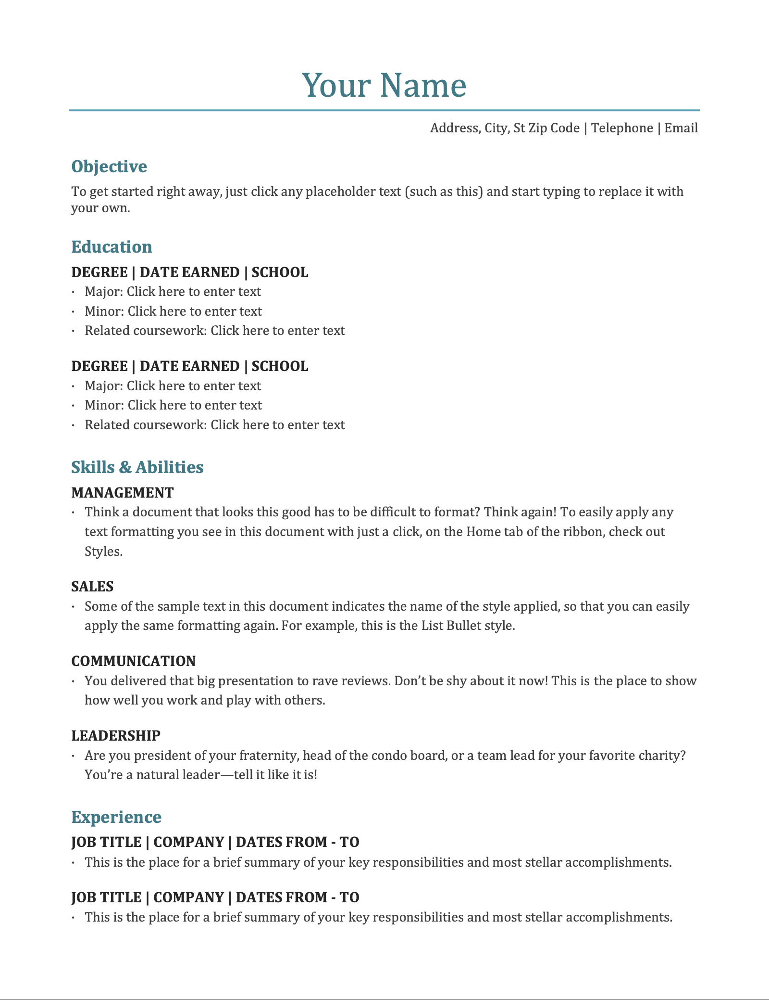

## Problems

1.  Shopping Cart (Box Model)
    Build the given layout using divs and box model
    Create a file called index.html The layout should look like the given template boxModel.png
    use any dummy images from google
    
2.  Create your own resume, design should match the image given. Either keep the dummy data or you
    can fill in your own data, whichever you want to do. No need to match colors given, but try to match
    font-size.
    link:
    
3.  Create the below layout using css and box-model
    
    For reference you can visit this website:- Movies
    Image Links:- images.txt
