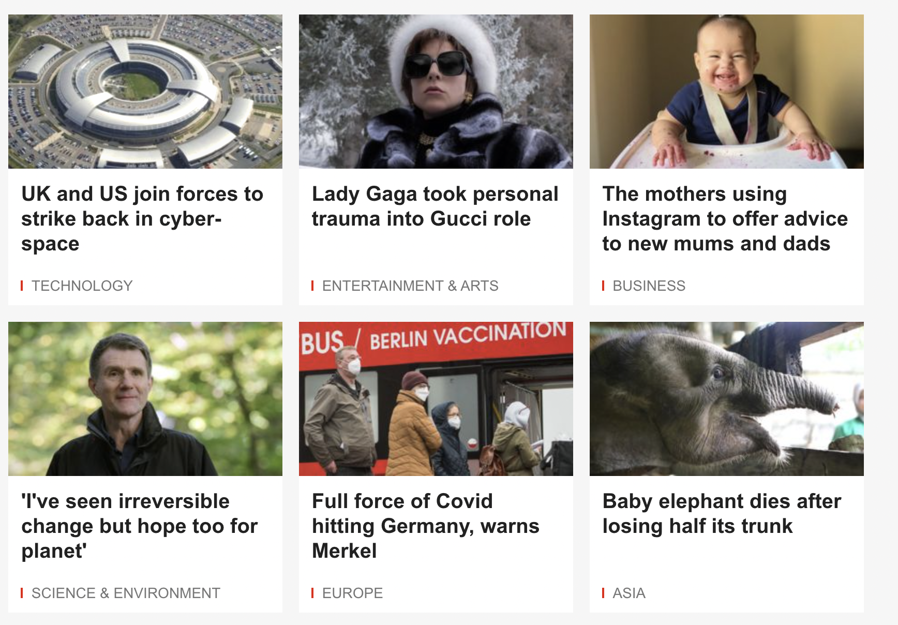
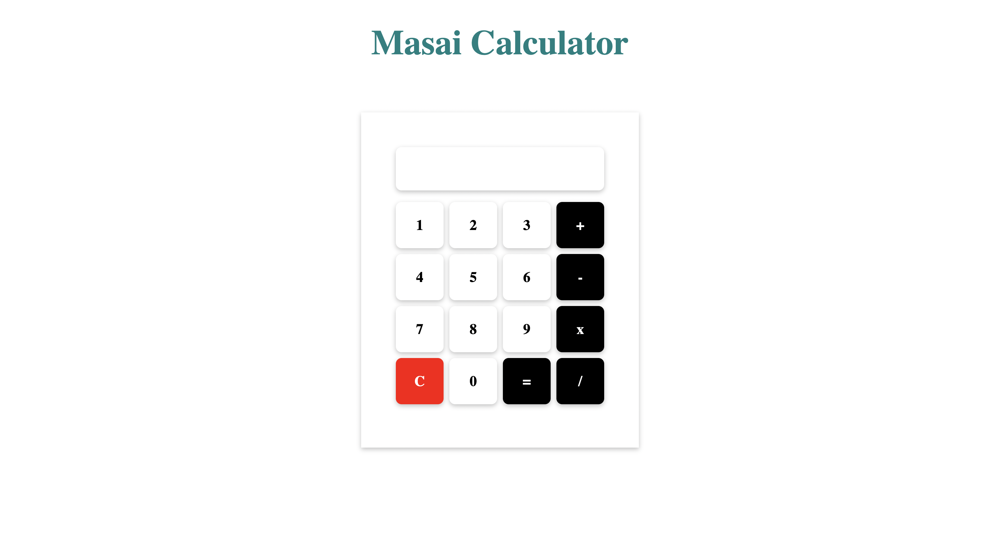
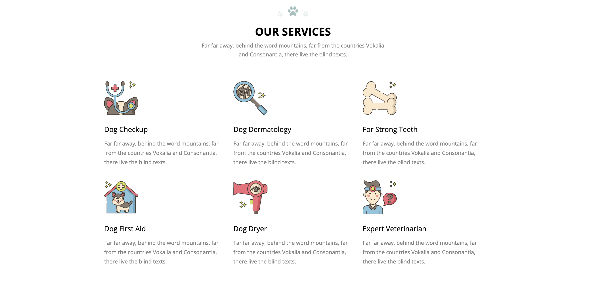

## Assignment-5 Problems

1. Use combinators to achieve the following layout flex cards.png
   for images use placeholder.com or random images from google
   Do not use inline styles, use combinators
   
2. Create a file calculator.html
   Your layout should like calculator.png
   Use combinators and flex to achieve the layout
   
3. Finish all the levels of game https://flukeout.github.io/
4. Build the given layout, use combinators
   petservice.png

   Website reference link : https://preview.colorlib.com/#dogge
   
