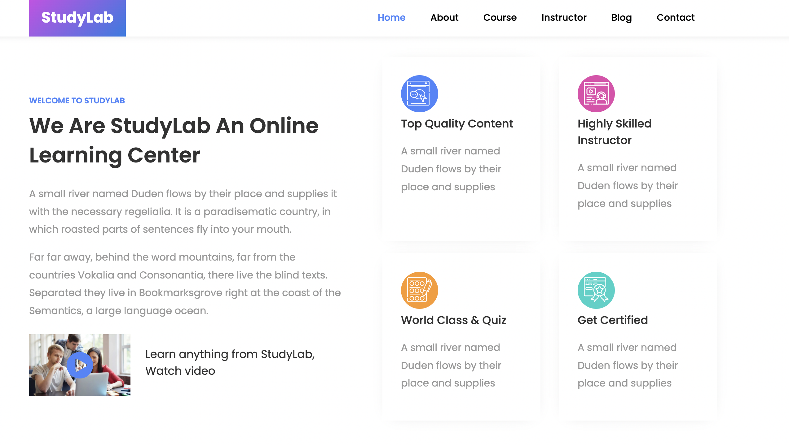

# Problems

1.  Build the given layout using flex and its properties
    study-lab.png
    Use dummy images from google, not required to use same images
    
2.  Build the layout using flex and its properties
    News.png
    Use dummy images from google
    
3.  Have fun with this game
    Visit this website https://flexboxfroggy.com/ and play the game
    Complete all levels of the game
    Happy gamin
